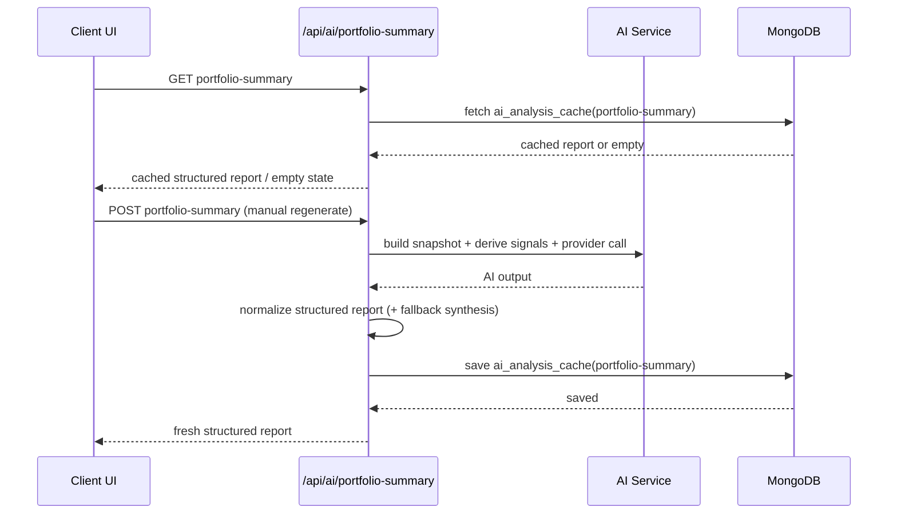
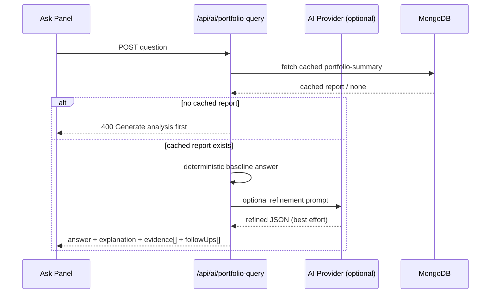
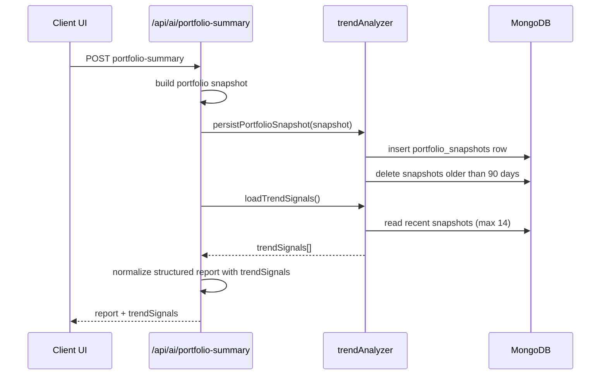

# AI Capabilities and Governance

AI in DeliveryHub is assistive only. It never writes to the database without explicit user action.

## Capabilities
- Wiki summary, key decisions, assumptions
- Q&A over pages and assets
- Template generation for new wiki pages
- Cross-module insights in AI Insights
- Diagram generation helpers where enabled
- Work item refinement and standup summaries
- Work item reassignment suggestions
- Portfolio summaries

## Governance
- Provider routing per task type
- Admin-controlled toggles by provider
- Supported providers include OpenAI, Open Router, Gemini, Anthropic, Hugging Face, and Cohere
- Default-provider resolution: Task Routing -> Admin default -> `AI_DEFAULT_PROVIDER`
- There is no hardcoded runtime default provider; if no task provider and no active default/env default is available, AI requests return a clear configuration error
- Task Routing supports `Use Active Default` per task (including `Portfolio Summary`) so tasks can inherit the resolved default provider instead of being pinned
- AI provider selection and execution are centralized in `src/services/aiRouting.ts`; AI routes call shared resolver/executor logic instead of duplicating provider decisions
- API keys are environment-managed and are not persisted in `ai_settings`
- Admin UI exposes selected default provider and active effective default provider
- Rate limiting per task
- Retention controls
- Audit logging of AI usage
- Explicit user actions required to apply AI outputs

## Storage
- Settings in `ai_settings`
- Audit logs in `ai_audit_logs`
- Rate limits in `ai_rate_limits`
- Persisted wiki insights in `wiki_ai_insights`
- Persisted AI Insights portfolio report in `ai_analysis_cache` (`_id: portfolio-summary`)

## AI Insights Portfolio Summary (Phase 12A)
- API contract split:
  - `GET /api/ai/portfolio-summary`: read latest persisted report only (no provider call)
  - `POST /api/ai/portfolio-summary`: manual regenerate, persist, return fresh report
- Cache-first UX:
  - Page load uses cached report first
  - No automatic provider generation on page visit
  - First-run empty state prompts explicit `Generate Analysis`
- Freshness policy:
  - `fresh`: generated within 24 hours
  - `stale`: older than 24 hours
  - stale reports still render with a stale banner; manual regenerate remains available
- Persisted report metadata includes:
  - `generatedAt`, `provider`, `model`, `freshnessStatus`, `snapshotHash`, `updatedAt`
- Provider normalization and fallback:
  - quota/credits/rate-limit errors normalized (not `AI_UNKNOWN_ERROR`)
  - attempted provider/model metadata preserved on terminal failures
  - if generation fails and a cached success exists, cached report is returned
- Rendering/export:
  - in-app report renders markdown with Wiki-style presentation (Aurora styling)
  - Markdown download available
  - PDF download is direct file download with styled report layout (no popup viewer tab)

## AI Insights Structured Intelligence (Phase 12B)
- 12B.1 introduced structured report contracts in `PortfolioSummaryResponse.report`:
  - `overallHealth`
  - `executiveSummary`
  - `topRisks`
  - `recommendedActions`
  - `concentrationSignals`
  - `questionsToAsk`
  - `markdownReport` (compatibility/export)
- 12B.1 also added:
  - deterministic signal derivation (`src/services/ai/portfolioSignals.ts`)
  - structured normalization + legacy conversion (`src/services/ai/normalizePortfolioReport.ts`)
  - structured-to-markdown formatter (`src/services/ai/formatPortfolioReportAsMarkdown.ts`)
- 12B.1.1 bugfix pass:
  - improved legacy markdown section extraction
  - deterministic enrichment when legacy extraction is weak
  - collapsible **Full Narrative Report** retained in UI
- 12B.2 refined presentation quality:
  - section cards and badges (health/severity/urgency)
  - clearer evidence rendering and empty-state messaging
  - responsive overflow-safe section layouts
- 12B.3 strengthened explainability and deterministic anchoring:
  - per-item `provenance`: `ai | deterministic | legacy`
  - risk evidence enforcement (minimum evidence grounding)
  - deterministic severity normalization using ratio thresholds
  - action urgency normalization + evidence linkage
  - concentration/question deterministic synthesis when AI output is thin
  - normalization telemetry includes section synthesis flags
- 12B.5 added interactive portfolio Q&A:
  - `POST /api/ai/portfolio-query` with authenticated, cache-backed querying over the latest structured portfolio summary
  - deterministic-first query answering with best-effort AI interpretation fallback
  - standardized response contract:
    - `answer`
    - `explanation`
    - `evidence[]` (`EvidenceItem[]` with `text`, `entities[]`, optional `provenance`)
    - `followUps[]`
  - graceful behavior when provider/parsing fails: still returns useful deterministic guidance from cached structured data
  - new query services:
    - `src/services/ai/queryEngine.ts`
    - `src/services/ai/suggestionGenerator.ts`
  - AI Insights UI now includes **Ask DeliveryHub AI**:
    - free-text question input
    - contextual quick suggestions from report/signals
    - evidence-backed answer rendering
    - follow-up chips that can be clicked to immediately re-query
- 12C.1 introduced operational drill-down from insights to entities:
  - typed evidence model in `src/types/ai.ts`:
    - `EntityType`: `workitem | application | bundle | milestone | review`
    - `EntityReference`: `type`, `id`, `label`, optional `secondary`
    - `EvidenceItem`: `text`, `entities[]`, optional `provenance`
  - structured report section evidence now uses `EvidenceItem[]`:
    - `topRisks`
    - `recommendedActions`
    - `concentrationSignals`
  - query response evidence now uses `EvidenceItem[]`
  - centralized evidence/entity mapping utility:
    - `src/services/ai/evidenceEntities.ts`
    - best-effort entity extraction from evidence text (exact IDs where present; group refs otherwise)
    - centralized entity link resolution for UI drill-down
  - normalization and deterministic synthesis now emit entity-anchored evidence:
    - `src/services/ai/normalizePortfolioReport.ts`
    - `src/services/ai/queryEngine.ts`
  - AI Insights UI evidence rendering upgraded with related-entity drill-down:
    - `src/components/ui/EntityEvidenceList.tsx`
    - used in risks/actions/signals/query-answer evidence blocks
  - fallback behavior preserved:
    - evidence still renders as plain text if no entity references are available
- 12C.2 introduced contextual related-entity panels:
  - response contract now includes `relatedEntitiesMeta` for both:
    - `GET/POST /api/ai/portfolio-summary`
    - `POST /api/ai/portfolio-query`
  - backend entity metadata resolver:
    - `src/services/entityMetaResolver.ts`
    - resolves secondary metadata per entity type (work items, milestones, reviews, applications, bundles)
  - panelized UI components:
    - `src/components/ui/EntityGroupPanel.tsx`
    - `src/components/ui/RelatedEntitiesSection.tsx`
  - related entities are grouped and ordered by type relevance:
    - `workitem -> milestone -> review -> application -> bundle`
  - default display limits and expansion behavior:
    - show up to 5 entities per group by default
    - if group size > 50, show 15 initially
    - `View all` / `Show less` toggle available when group exceeds default
  - contextual ordering is applied within each group using available metadata (e.g., blocked/overdue/unassigned signals for work items)
  - integrated under Top Risks, Recommended Actions, Concentration Signals, and Query Answers
- 12C.3 expanded deterministic portfolio query intelligence:
  - weighted intent detection in `src/services/ai/queryEngine.ts` now supports:
    - work-item queries (overdue, blocked, unassigned, urgent, milestone-threatening)
    - bundle analysis/ranking
    - application health/risk queries
    - milestone exposure queries
    - review cycle status queries
    - owner/capacity workload queries
    - risk-ranking queries
  - new reusable extractor layer:
    - `src/services/ai/knowledgeExtractors.ts`
    - `extractWorkItemStats`, `extractBundleStats`, `extractMilestoneStats`, `extractApplicationStats`, `extractReviewStats`, `extractOwnerStats`
  - `PortfolioSnapshot` now carries optional lightweight entity lists (`items[]`) for deterministic list/ranking answers without query-time DB reads
  - query responses now include:
    - richer `evidence[]` with entity references
    - contextual deterministic follow-up prompts (2–4)
    - optional top-level `entities[]` for downstream UI drill-down usage
  - AI refinement remains optional; deterministic answer path remains primary and fast
- 12C.4 added persistent investigation workspace capabilities:
  - new persisted collection: `ai_saved_queries`
  - saved investigation model (`SavedInvestigation`) includes:
    - `question`, `normalizedIntent`, `answer`, `explanation`
    - `evidence[]`, `entities[]`, `followUps[]`
    - `pinned`, `createdAt`, `updatedAt`, optional `relatedEntitiesMeta`
  - backend service:
    - `src/services/ai/investigationService.ts`
    - save/list/pin-delete/update/refresh operations with owner-scoped access
    - indexes on `(userId, createdAt)` and `(userId, pinned, updatedAt)`
  - new authenticated APIs:
    - `GET/POST /api/ai/investigations`
    - `PATCH/DELETE /api/ai/investigations/:id`
    - `POST /api/ai/investigations/:id/refresh`
  - refresh behavior:
    - reruns deterministic query engine against current cached portfolio context
    - updates stored snapshot answer fields
  - AI Insights UI now includes:
    - `Pinned Insights` panel (max 6)
    - `Saved Investigations` panel (run, refresh, pin/unpin, delete)
    - `Query History` panel (session-scoped, up to 20 recent entries, run again, save)
  - investigations are private to the authenticated owner and do not introduce cross-user sharing
- 12D added temporal intelligence with portfolio trend analysis:
  - new persisted collection: `portfolio_snapshots`
  - snapshots are persisted on portfolio-summary regeneration and retained for the last 90 days
  - trend analyzer service (`src/services/ai/trendAnalyzer.ts`) computes metric deltas over recent history (max 14 snapshots, default 7-snapshot trend window)
  - structured report contract now supports `trendSignals[]` with:
    - `metric`, `direction`, `delta`, `timeframeDays`, optional `summary`
  - supported trend metrics:
    - `unassignedWorkItems`
    - `blockedWorkItems`
    - `overdueWorkItems`
    - `activeWorkItems`
    - `criticalApplications`
    - `overdueMilestones`
  - trend extraction helpers added in `src/services/ai/knowledgeExtractors.ts`:
    - `extractTrendMetrics`
    - `extractRiskTrend`
    - `extractWorkloadTrend`
    - `extractMilestoneTrend`
  - deterministic query engine now answers trend-oriented questions, including:
    - “Is delivery improving?”
    - “Is risk increasing?”
    - “Are blocked tasks increasing?”
    - “Is backlog growing?”
    - “Are milestones getting healthier?”
  - AI Insights UI now includes a dedicated **Portfolio Trends** section with directional cards (`↑`, `↓`, `→`)
  - quick suggestions are trend-aware when rising trend signals are detected
- 12E added proactive alerting, health scoring, and predictive risk detection:
  - new deterministic health scoring service: `src/services/ai/healthScorer.ts`
  - weighted portfolio health score (`0-100`) is computed from:
    - unassigned ratio (20%)
    - blocked ratio (20%)
    - overdue ratio (20%)
    - active work ratio (15%)
    - critical app count (15%)
    - overdue milestone count (10%)
  - new predictive risk engine: `src/services/ai/predictiveRisk.ts`
    - execution risk escalation
    - milestone slip risk
    - review congestion risk
    - capacity pressure risk
  - new alert detector: `src/services/ai/alertDetector.ts`
    - trend-based alerts
    - threshold-based alerts
    - predictive alerts
  - structured report contract now supports:
    - `healthScore`
    - `alerts[]`
  - deterministic normalization now computes and merges:
    - trend signals
    - health score
    - active alerts
  - query engine now supports alert/health/predictive prompts:
    - “What alerts are active now?”
    - “Show me emerging portfolio risks”
    - “Is delivery risk increasing in the next 7 days?”
    - “What is the portfolio health score?”
  - quick suggestions now include alert and health-oriented prompts
  - AI Insights UI now includes:
    - **Portfolio Health** card with component breakdown bars
    - **Alerts** panel with severity ordering, rationale, evidence, and related entities
    - **Save as Investigation** action directly from each alert card
- 12F.1 added watcher subscriptions and in-app notifications:
  - new watcher + notification contracts in `src/types/ai.ts`:
    - `WatcherType`: `alert | investigation | trend | health`
    - `Watcher`
    - `Notification`
  - new persisted collections:
    - `ai_watchers`
    - `ai_notifications`
  - new notification/watcher engine:
    - `src/services/ai/notificationEngine.ts`
    - watcher CRUD helpers
    - notification read/list helpers
    - `evaluateWatchersForUser(...)` with condition evaluation + trigger cooldown + `lastTriggeredAt` updates
  - new authenticated APIs:
    - `GET/POST /api/ai/watchers`
    - `PATCH/DELETE /api/ai/watchers/:id`
    - `GET /api/ai/notifications`
    - `PATCH /api/ai/notifications/:id`
  - watcher evaluation entry points:
    - after AI Insights report regeneration (`POST /api/ai/portfolio-summary`)
    - after saved investigation refresh (`POST /api/ai/investigations/:id/refresh`)
  - AI Insights UI now includes:
    - `NotificationCenter` (unread badge, unread/read grouping, mark as read)
    - `WatcherList` (list, enable/disable, delete)
    - `WatcherConfigForm` (create with type/target/condition)
    - contextual watcher creation actions from:
      - alert cards (`Watch this alert`)
      - trend cards (`Watch this trend`)
      - health score card (`Watch health <= 60`)
      - saved investigations (`Watch`)
- 12F.2 added external delivery and per-watcher delivery preferences:
  - new dispatcher and channel adapter services:
    - `src/services/ai/notificationDispatcher.ts`
    - `src/services/ai/emailChannel.ts`
  - watcher contract now includes `deliveryPreferences`:
    - `in_app.enabled`
    - `email.enabled`
    - `email.severityMin` (`low|medium|high|critical`)
  - notification contract now includes per-channel `delivery` tracking:
    - `in_app.status`, `in_app.deliveredAt`
    - `email.status` (`pending|sent|failed|suppressed`)
    - `email.lastAttemptedAt`, `email.lastErrorMessage`
  - dispatch pipeline behavior:
    - resolves watcher delivery preferences before channel send
    - applies severity gating for email (`severityMin`)
    - applies cooldown suppression for repeated sends
    - resolves user email/name from `users`
    - updates channel delivery status on success/failure/suppression
  - watcher APIs now accept `deliveryPreferences` payloads:
    - `POST /api/ai/watchers`
    - `PATCH /api/ai/watchers/:id`
  - Notification Center now shows channel delivery badges for in-app and email, including failed-email error tooltip
  - Watcher Config form now supports delivery preference editing (in-app toggle, email toggle, minimum email severity)
- 12F.3 added multi-channel external delivery and digest scheduling:
  - new channel adapters:
    - `src/services/ai/slackChannel.ts`
    - `src/services/ai/teamsChannel.ts`
  - new digest service:
    - `src/services/ai/digestService.ts`
    - digest queue collection: `ai_notification_digest_queue`
    - queue/process API: `enqueueNotificationForDigest(...)`, `processDigestQueue()`, scheduler start/stop
  - dispatcher upgrades (`src/services/ai/notificationDispatcher.ts`):
    - supports `email`, `slack`, `teams`
    - channel-level severity gating and cooldown suppression
    - per-channel delivery state updates (`pending|sent|failed|suppressed`) with `lastAttemptedAt` and `lastErrorMessage`
    - digest-aware routing: when watcher digest is enabled, external immediate sends are suppressed and queued for digest
  - watcher delivery preferences now include:
    - `slack.enabled`, `slack.webhookUrl`, `slack.severityMin`
    - `teams.enabled`, `teams.webhookUrl`, `teams.severityMin`
    - `digest.enabled`, `digest.frequency` (`hourly|daily`)
  - notification contract now includes:
    - `delivery.slack`
    - `delivery.teams`
    - `deliveryMode` (`immediate|digest`)
  - AI Insights UI updates:
    - `WatcherConfigForm` now supports Slack, Teams, and Digest options
    - `NotificationCenter` now renders delivery badges for Slack/Teams and shows digest mode chip
  - environment configuration used by channel/digest services:
    - `NOTIFICATION_SLACK_MODE` (`webhook|disabled`)
    - `NOTIFICATION_TEAMS_MODE` (`webhook|disabled`)
    - `NOTIFICATION_DIGEST_ENABLED` (`true|false`)
    - `DIGEST_INTERVAL_MINUTES` (number)

## Visual Flows

### Portfolio Summary Load / Regenerate
```text
Client UI            API Route                      AI Service                  DB
---------            ---------                      ----------                  --
AI Insights
    | GET /api/ai/portfolio-summary
    |---------------------------------------------->|
    |                              fetch ai_analysis_cache(portfolio-summary)
    |<----------------------------------------------|
    | cache hit?
    |  yes -> return cached structured report
    |  no  -> show empty state ("Generate Analysis")
    |
Generate/Regenerate click
    | POST /api/ai/portfolio-summary
    |---------------------------------------------->|
    |                         build snapshot -> derive signals -> prompt
    |----------------------------------------------> execute provider
    |<---------------------------------------------- AI raw response
    |                         normalize structured report (+ fallback synthesis)
    |                              save ai_analysis_cache(portfolio-summary)
    |<----------------------------------------------|
    | render structured sections + narrative + exports
```



### Ask DeliveryHub AI Query Flow
```text
Client UI            API Route                      AI Service                  DB
---------            ---------                      ----------                  --
Ask panel submit
    | POST /api/ai/portfolio-query (question)
    |---------------------------------------------->|
    |                              fetch cached portfolio-summary
    |<----------------------------------------------|
    | no cached report -> 400 ("Generate analysis first")
    | yes:
    |   deterministic answer baseline (queryEngine)
    |----------------------------------------------> optional AI refinement
    |<---------------------------------------------- parsed/normalized response
    | return answer + explanation + evidence[] + followUps[]
    | render answer card + follow-up chips + dynamic suggestions refresh
```



### Trend Snapshot and Analysis Flow (12D)
```text
Client UI            Summary API                    Trend Service                DB
---------            -----------                    -------------                --
Regenerate click
    | POST /api/ai/portfolio-summary
    |---------------------------------------------->|
    |                         build snapshot (current portfolio state)
    |----------------------------------------------> persistPortfolioSnapshot
    |----------------------------------------------> insert summary row
    |----------------------------------------------> delete rows older than 90 days
    |----------------------------------------------> load recent snapshots (<=14)
    |----------------------------------------------> compute trend signals
    |                         normalize report with trendSignals[]
    |<----------------------------------------------|
    | render structured sections + Portfolio Trends cards
```



### Evidence Entity Drill-Down (12C.1)
```text
Structured Section / Query Answer
    |
    | evidence[] -> EvidenceItem { text, entities[] }
    |
EntityEvidenceList
    |
    | per evidence item:
    |   - show plain text evidence
    |   - if entities exist, show clickable chips
    |
    | grouped "Related Entities" subsection
    |   workitem / application / bundle / milestone / review
    |
    | click chip -> resolveEntityHref(entity)
    |             -> navigate to existing DeliveryHub page/view
```

```mermaid
flowchart TD
  A[Structured section or query answer] --> B[evidence: EvidenceItem[]]
  B --> C[EntityEvidenceList]
  C --> D[Render evidence text]
  C --> E{entities available?}
  E -- Yes --> F[Render clickable entity chips]
  F --> G[Group into Related Entities by type]
  G --> H[resolveEntityHref(entity)]
  H --> I[Navigate to existing DeliveryHub page/view]
  E -- No --> J[Keep plain text evidence]
```

## Where AI Shows Up
- Wiki page view: AI dropdown for summary, key decisions, assumptions
- Wiki assets: same AI dropdown plus Q&A panel
- Work Items: summary, refinement, and assignment assistance
- Dashboards: AI Insights rollups
- Ops Center: `POST /api/ai/operations-intelligence` for SRE anomaly/scaling insights

## How AI Is Applied
- AI responses are generated in API routes
- Users explicitly apply or copy AI output
- No automatic DB writes from AI output
